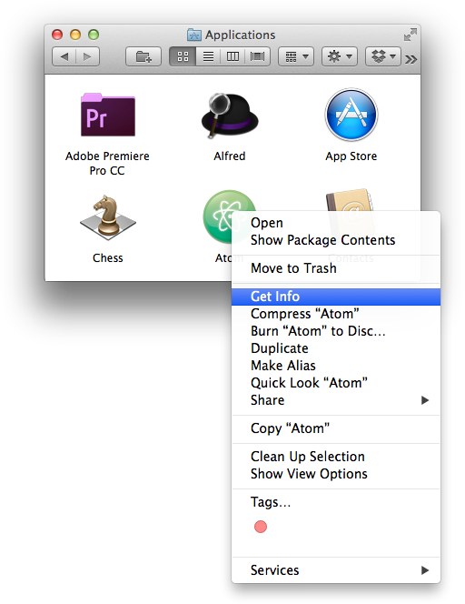
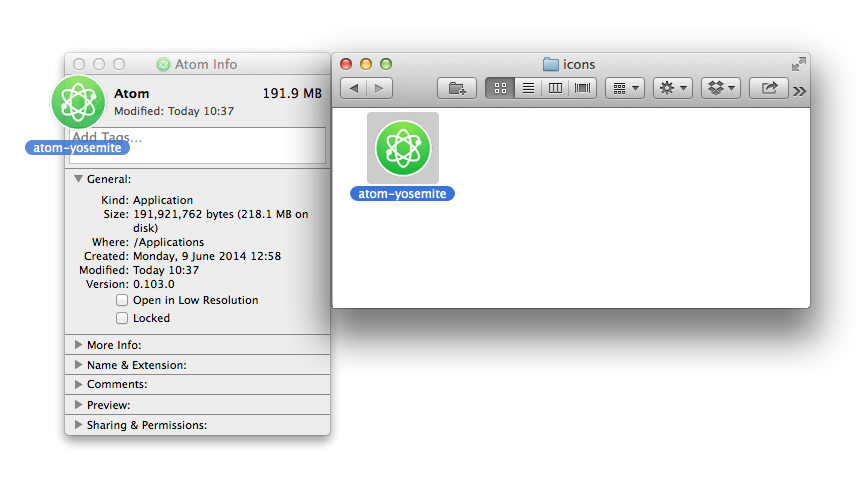

## Replacing the Atom Icon
Replace the official Atom Icon with the [Atom-Yosemite-Icon](https://dribbble.com/shots/1590423-Atom-Yosemite-Icon
) designed by [Rory McCawl](twitter.com/rmccawl).

1. Locate your installed Atom App, typically in Appications, then right click on the file and go to 'Get Info'

2. Drag the new icon file to the top right of the 'Get Info' pane to replace the exsiting icon

