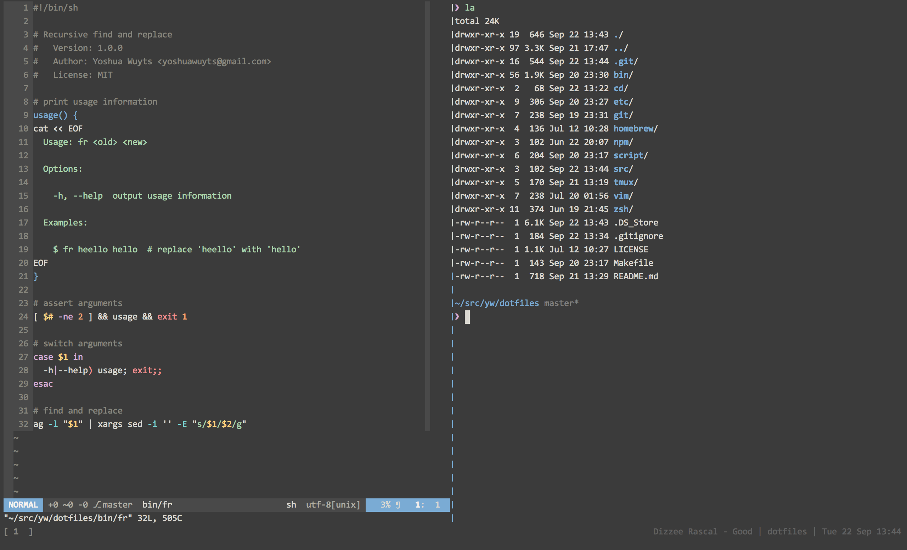

# Dotfiles
OS X configuration files. There's no place like `~/`.

## Preview


## Installation
`dotfiles` expects to run in an `xrvt` terminal to display colors correctly.
```sh
$ mkdir -p ~/src/yw
$ git clone https://github.com/yoshuawuyts/dotfiles.git ~/src/yw/dotfiles
$ cd ~/src/yw/dotfiles
$ ./script/{setup,vim,zsh,tmux}
```

## Installed software
Not all of this is required for the configuration, it's just the list of
software that I personally use and recommend.

### interface

### internet

### media

### office

### programming

### utilities

### fonts / themes

### included scripts and tools

## See also
- [pengwynn/dotfiles](https://github.com/pengwynn/dotfiles)
- [kevensuttle/osxdefaults](https://github.com/kevinSuttle/OSXDefaults/blob/master/.osx)
- [marcusandre/dotfiles](https://github.com/marcusandre/dotfiles)
- [inject3d/dotfiles](https://github.com/inject3d/dotfiles)

## License
[MIT](https://tldrlegal.com/license/mit-license)
